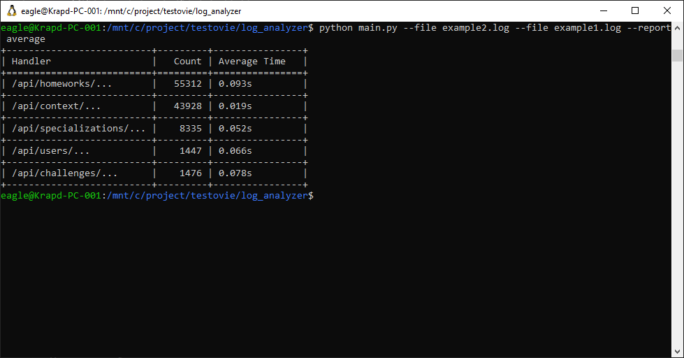
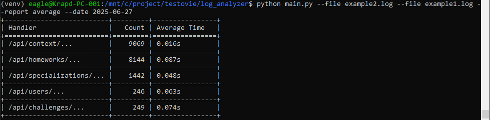
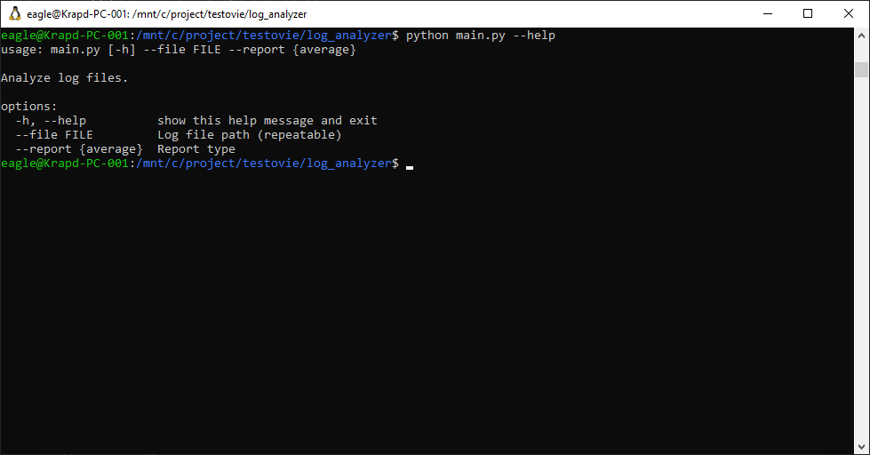

## Test task.
### The project reads a file and generates a report with a list of endpoints, the number of requests for each endpoint, and the average response time. The paths to the files and the name of the report are passed as parameters, for example python main.py --file file.log --report average, it is possible to filter records by date --date YYYY-MM-DD

